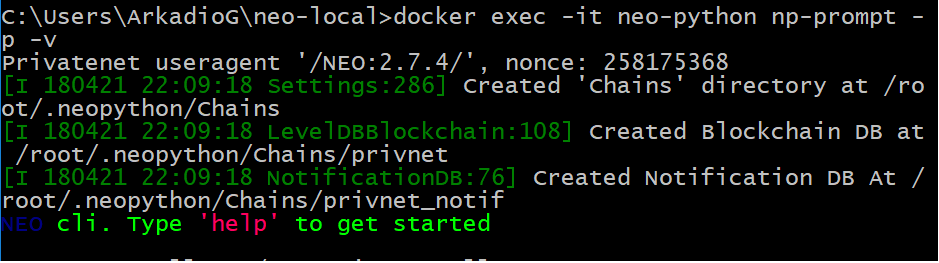

# neo-local instalacja na Windows

1. sklonuj repozytorium **neo-local** do wybranego przez siebie folderu:  
    `git clone https://github.com/neoauth/neo-local.git`

1. przejdź do folderu repozytorium  
    `cd /neo-local`
    
1. uruchom polecenie:  
    `docker-compose up -d --build --remove-orphans --force-recreate`  
    poczekaj aż zostaną zainstalowane wszystkie wymagane składniki

1. uruchom węzeł **neo-python**:  
    `docker exec -it neo-python np-prompt -p -v`  
    wiersz poleceń powinien wyglądać podobnie:  
    
    
 
1. Aby zastopować kontenery (są cały czas uruchomione w tle) wpisz polecenie `make stop`
 
 ####[Kolejny krok - otwarcie portfela](wallet.md) 